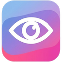
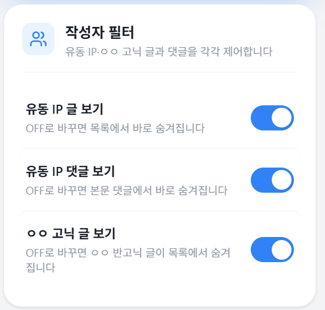
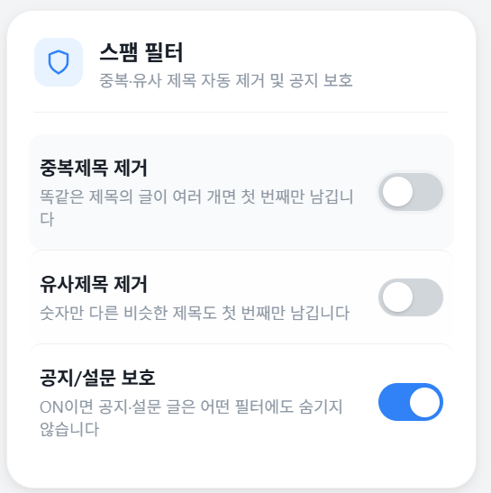
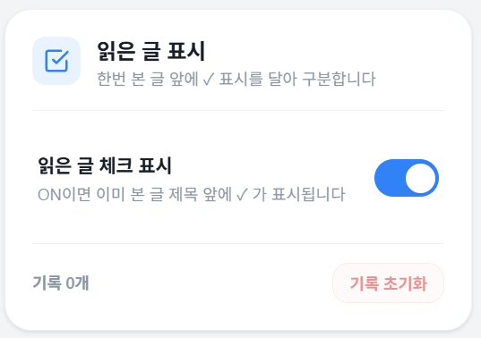
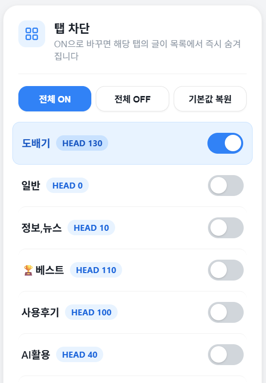

<div align="center">



# SingulEYE (특안)

**DC인사이드 특이점이 온다 갤러리 전용 크롬 확장 프로그램**

[](https://github.com/AGI-Deep/SingulEYE)
[](https://developer.chrome.com/docs/extensions/mv3/)
[](LICENSE)
[](https://github.com/AGI-Deep/SingulEYE/releases)

<br />

> **깨끗한 갤러리 환경을 위한 올인원 필터링 솔루션**
>
> 유동 IP / ㅇㅇ 고닉 / 스팸 / 말머리 차단을 하나의 확장으로.

<br />


</div>

---

## ✨ 주요 기능

<div align="center">

### 👤 작성자 필터


</div>

| 기능 | 설명 |
|:---|:---|
| **유동 IP 글 보기** | 유동 IP 작성 글 ON/OFF |
| **유동 IP 댓글 보기** | 유동 IP 댓글 ON/OFF |
| **ㅇㅇ 고닉 글 보기** | ㅇㅇ 반고닉 글 ON/OFF |

<br />

<div align="center">

### 🛡️ 스팸 필터


</div>

| 기능 | 설명 |
|:---|:---|
| **중복제목 제거** | 동일 제목 → 첫 글만 유지 |
| **유사제목 제거** | 숫자만 다른 제목도 감지 |
| **공지/설문 보호** | 공지/설문은 필터 무시 |

<br />

<div align="center">

### ✅ 읽은 글 표시


</div>

| 기능 | 설명 |
|:---|:---|
| **체크 마크** | 이미 본 글 제목 앞에 ✓ 표시 |
| **최대 5,000건** | 자동 관리되는 방문 기록 |
| **기록 초기화** | 원클릭 방문 기록 삭제 |

<br />

<div align="center">

### 🏷️ 말머리(탭) 차단


</div>

| 기능 | 설명 |
|:---|:---|
| **개별 ON/OFF** | 말머리별 차단 토글 |
| **전체 ON/OFF** | 원클릭 전체 제어 |
| **기본값 복원** | 초기 상태로 되돌리기 |

---

## 🏗️ 아키텍처

```
┌─────────────────────────────────────────────────────────┐
│                    Chrome Extension (MV3)                │
│                                                         │
│  ┌──────────┐    chrome.tabs     ┌───────────────────┐  │
│  │ popup.js │ ── sendMessage ──→ │   content.js      │  │
│  │ popup.html│ ←── response ─── │                   │  │
│  │ popup.css │                   │  ┌─────────────┐  │  │
│  └──────────┘                   │  │ MutationObs │  │  │
│       ↕                         │  │  (실시간 DOM  │  │  │
│  ┌──────────┐                   │  │   변경 감지)  │  │  │
│  │ shared.js │ ← 공유 설정/유틸 → │  └─────────────┘  │  │
│  └──────────┘                   └───────────────────┘  │
│       ↕                                ↕               │
│  ┌─────────────────────────────────────────────────┐   │
│  │          chrome.storage.sync  (설정)             │   │
│  │          chrome.storage.local (방문 기록)         │   │
│  └─────────────────────────────────────────────────┘   │
└─────────────────────────────────────────────────────────┘
```

---

## 📂 프로젝트 구조

```
SingulEYE/
├── manifest.json      # Chrome MV3 확장 매니페스트
├── shared.js          # 공유 상수, 설정 정규화, 유틸리티
├── content.js         # 콘텐츠 스크립트 (DOM 필터링 엔진)
├── popup.html         # 팝업 UI 마크업
├── popup.css          # Toss 스타일 모던 UI
├── popup.js           # 팝업 인터랙션 로직
├── icon16.png         # 툴바 아이콘 (16x16)
├── icon48.png         # 관리 페이지 아이콘 (48x48)
├── icon128.png        # 스토어 아이콘 (128x128)
└── README.md          # 이 문서
```

---

## 🚀 설치 방법

### 방법 1: ZIP 다운로드 (추천)

1. [**Releases 페이지**](https://github.com/AGI-Deep/SingulEYE/releases/latest)에서 **SingulEYE-v1.0.zip** 다운로드
2. 압축 해제
3. 크롬 주소창에 `chrome://extensions/` 입력
4. 우측 상단 **개발자 모드** ON
5. **"압축해제된 확장 프로그램을 로드합니다"** 클릭 → 폴더 선택

### 방법 2: 소스에서 직접 설치

```bash
git clone https://github.com/AGI-Deep/SingulEYE.git
# 이후 위 3~5번 동일하게 진행
```

---

## 🎯 사용법

| 단계 | 설명 |
|:---:|:---|
| **1** | [특이점이 온다 갤러리](https://gall.dcinside.com/mgallery/board/lists/?id=thesingularity) 접속 |
| **2** | 크롬 툴바에서 SingulEYE 아이콘 클릭 |
| **3** | 원하는 필터 ON/OFF 토글 |
| **4** | 설정 즉시 적용 — 새로고침 불필요! |

---

## 🔧 기술 스택

| 구분 | 기술 |
|:---|:---|
| **플랫폼** | Chrome Extension Manifest V3 |
| **언어** | Vanilla JavaScript (ES2020+) |
| **스토리지** | `chrome.storage.sync` (설정) / `chrome.storage.local` (방문 기록) |
| **DOM 감지** | `MutationObserver` (실시간 변경 추적) |
| **UI 디자인** | Toss 스타일 모던 UI (CSS Custom Properties) |
| **통신** | `chrome.tabs.sendMessage` (Popup ↔ Content Script) |

---

## 🔍 필터링 엔진 동작 원리

```
게시글 목록 로드 / DOM 변경 감지
        │
        ▼
┌─ Pass 1: 메타데이터 수집 ─────────────────────┐
│  각 행(row)마다:                               │
│  • 공지/설문 여부 판별                          │
│  • 유동 IP 여부 (data-ip 속성)                  │
│  • ㅇㅇ 반고닉 여부 (data-nick, uid 확인)       │
│  • 말머리 라벨 추출                             │
│  • 제목 정규화 → exact / loose 키 생성          │
└───────────────────────────────────────────────┘
        │
        ▼
┌─ 중복 인덱스 구축 ────────────────────────────┐
│  exact 키 / noDigits 키별 출현 횟수 카운트     │
│  → 2회 이상 = 중복 그룹                        │
└───────────────────────────────────────────────┘
        │
        ▼
┌─ Pass 2: 필터 적용 ──────────────────────────┐
│  보호 대상(공지/설문) → 항상 표시              │
│  기본 필터 매칭 → 숨김                        │
│  중복 그룹 → 첫 번째만 유지, 나머지 숨김       │
│  읽은 글 → ✓ 마크 적용                        │
└───────────────────────────────────────────────┘
```

---

## 📋 권한 안내

| 권한 | 용도 |
|:---|:---|
| `storage` | 필터 설정 및 방문 기록 저장 |
| `tabs` | 팝업 ↔ 콘텐츠 스크립트 통신 |

> **개인정보를 수집하거나 외부 서버로 전송하지 않습니다.**
> 모든 데이터는 브라우저 로컬에만 저장됩니다.

---

## 🗺️ 로드맵

- [ ] 크롬 웹 스토어 정식 배포
- [ ] 키워드 기반 제목/본문 필터링
- [ ] 특정 닉네임 차단 리스트
- [ ] 다크 모드 지원
- [ ] 다른 갤러리 지원 확장

---

## 🤝 기여 방법

```bash
# 1. Fork this repo
# 2. Create your feature branch
git checkout -b feature/amazing-feature

# 3. Commit your changes
git commit -m "feat: Add amazing feature"

# 4. Push to the branch
git push origin feature/amazing-feature

# 5. Open a Pull Request
```

---

## 📜 라이선스

이 프로젝트는 [MIT License](LICENSE) 하에 배포됩니다.

---

<div align="center">


**Made with ❤️ for 특이점이 온다 갤러리**

<sub>© 2026 AGI-Deep · All rights reserved</sub>

</div>
